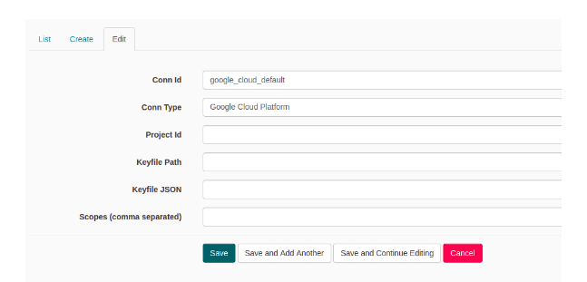
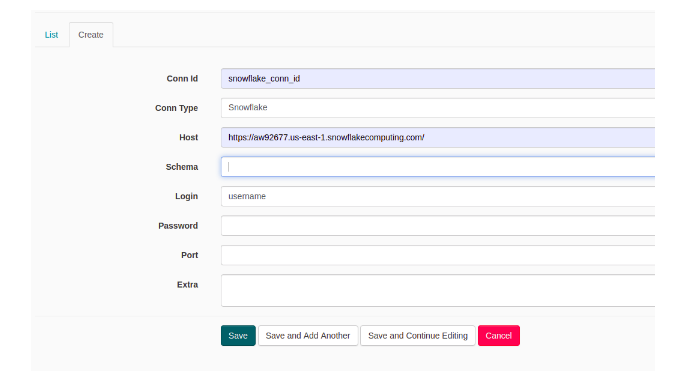
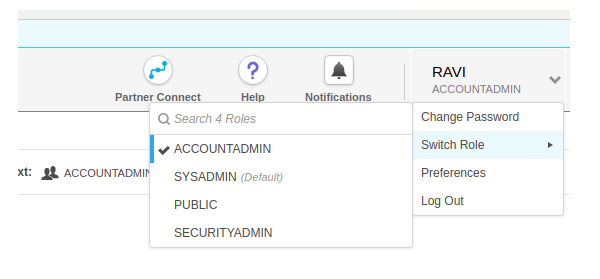
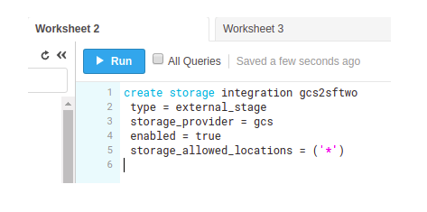
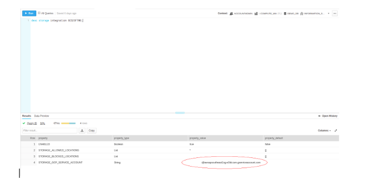

# Google-analytics-to-snowflake
Transfer data google analytics to snowflake through google cloud storage

Step 1: Download the docker utility
 
    https://docs.docker.com/install/linux/docker-ce/ubuntu/

Step 2: Pull the Container image from docker hub
    
    sudo docker pull countantsteam/ga-to-snowflake:v1

Step 3: Run the container in the terminal with all services

    sudo docker run  -it -p 9000:8000 countantsteam/ga-to-snowflake:v1 /bin/bash

Here you can see, three ports are exposed. 
These are internal ports of containers:

*   Port 8000 for apache-airflow

You can change the host ports as you want here, we have used 9000 respectively.

Step 4: Run all services using the command

    $: airflow initdb
    $: countants.sh 

Command will start all the services of the container including all the services. Then you are ready to test all the services.

Step 5: Visit the following URLs

Apache - Airflow :  
    http://your_ip:port

here use port  9000 in our case

All the ports we are using which we have mentioned in the command while running the docker command.

##### *NOTE: whatever port you use should not be in use by another application on your host machine.

Configuring Connections in Apache -airflow
In apache airflow here you have to configure connections for google cloud storage, google analytics, and snowflake.

1.Go To

Here you go connections.

2.You will see many connections on the list. Scroll down and select google_cloud_default.

3.Create a new connection for google cloud analytics connection.

4.Create a new connection for a snowflake.

If you want to add your own customized dags into the container you can use the following command.

    $: docker cp   sample_dag.py container_tag:/root/airflow/dags/

# Snowflake

1. First login into snowflake account, then change the role to ACCOUNTADMIN. Please find an image for your reference.

2. First create storage integration objects using below command:

        create storage integration <integration_object_name> type = external_stage storage_provider = gcs enabled = true storage_allowed_locations = ('*')

Please find an image for your reference:

3. Get information about gcs2sftwo integration object

        desc storage integration <integration_object_name>;
	
We are getting one service account for this integration. We have to give “storage admin”  permission for this service account in GCP IAM. Please find an image for your reference.

4. Create a new table using the below command:

        CREATE OR REPLACE TABLE <table_name>(cloumn_name column_type)

5.Run below to copy data from gcs to snowflake

	copy into <table_name>
 	from 'gcs://<bucket name>/file_name'
  	storage_integration = gcs2sftwo;

Once the apache airflow and snowflake is configured.

You are ready to go.
